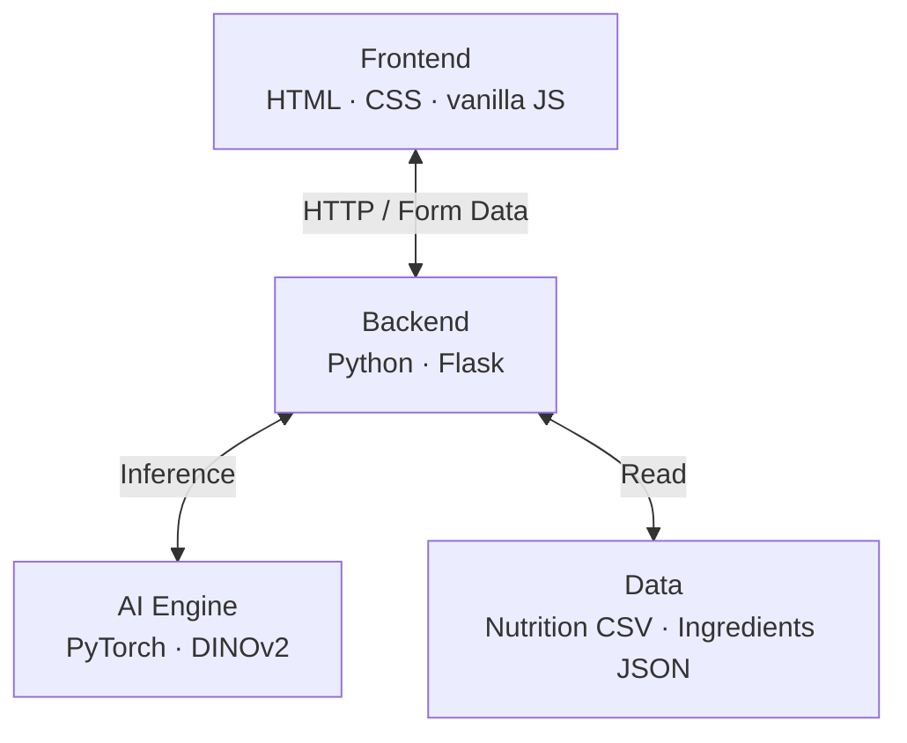

# 🍽️ FoodCal.ai — Food Recognition & Nutrition Analysis

> Snap a photo of a meal and get an instant calorie & macro breakdown, powered by a fine-tuned **DINOv2 Vision Transformer**. Don't have a photo? Search by name, or list what's in your fridge and get recipe suggestions.


A full-stack computer-vision project: a Vision Transformer fine-tuned on **Food-101**, wrapped in a Flask app that links predictions to a nutrition database and an ingredient-based recipe recommender.

<!-- Add a screenshot/GIF of the app here, e.g. docs/demo.png, then update this line: -->
<!--  -->

---

## ✨ Features

- **📷 Food recognition from an image** — upload a file or paste an image URL; the model classifies it into one of 101 dishes.
- **🔎 Search by name** — type a dish to look up its nutrition directly.
- **🥗 Nutrition breakdown** — calories, protein, carbs, fats, fiber, sugars and sodium per dish.
- **👨‍🍳 "What can I cook?"** — enter the ingredients you have and get ranked recipe matches, with optional macro filters (max calories, min protein, etc.).

## 🧠 Model & Results

| | |
|---|---|
| **Architecture** | DINOv2-Base (Vision Transformer) |
| **Dataset** | [Food-101](https://huggingface.co/datasets/food101) — 101 classes |
| **Split** | 75,750 train / 25,250 validation |
| **Training** | 3 epochs · lr 2e-5 · batch size 32 · FP16 mixed precision |
| **Top-1 accuracy** | **92.35%** on a 2,000-image sample of the Food-101 validation split |

The full fine-tuning pipeline — data loading, preprocessing, training (resumed across Kaggle GPU sessions) and evaluation — is documented in [`finetuning_notebook.ipynb`](finetuning_notebook.ipynb), which includes the live training and evaluation outputs. Run `python evaluate_model.py --food101` to reproduce the metrics on the held-out validation set.

## 🏗️ Architecture



1. The client validates the input and POSTs it to `/predict` (image/URL/text) or `/suggest` (ingredients).
2. Flask converts the image to a PIL object and runs it through the `AutoImageProcessor` + model.
3. The predicted class label keys into the in-memory nutrition and ingredient lookups.
4. The server renders the result (dish name, nutrition card, ingredient list).

## 🛠️ Tech Stack

**ML:** PyTorch · Hugging Face Transformers · DINOv2 · scikit-learn (evaluation)
**Backend:** Python · Flask
**Frontend:** HTML · CSS · vanilla JavaScript
**Data:** pandas/CSV · JSON

## 🚀 Getting Started

### 1. Clone & install

```bash
git clone https://github.com/<your-username>/foodcal.ai.git
cd foodcal.ai
python -m venv .venv && source .venv/bin/activate   # Windows: .venv\Scripts\activate
pip install -r requirements.txt
```

### 2. Get the model

The fine-tuned weights (~347 MB) are **not** stored in this repo (they exceed GitHub's file-size limit). Choose one:

- **Option A — download from the Hugging Face Hub** (recommended):
  ```bash
  export MODEL_PATH="<your-username>/dinov2-food101"   # the app loads it straight from the Hub
  ```
  > Upload your weights once with `huggingface-cli upload <your-username>/dinov2-food101 ./my_final_dinov2_food101_model_FULL`, then replace the placeholder above.
- **Option B — reproduce it yourself** by running [`finetuning_notebook.ipynb`](finetuning_notebook.ipynb) (Kaggle/Colab GPU recommended) and pointing `MODEL_PATH` at the output folder.

By default the app looks for a local folder `./my_final_dinov2_food101_model_FULL`. Override it any time with the `MODEL_PATH` environment variable.

### 3. Run

```bash
python app.py
```

Open **http://localhost:5001** in your browser.

## ✅ Tests

```bash
pip install pytest
pytest
```

Covers the home/cook pages, text search, and recipe suggestion endpoints. (Tests load the model, so make sure `MODEL_PATH` is set up first.)

## 📁 Project Structure

```
foodcal.ai/
├── app.py                     # Flask app: routing, model inference, nutrition & recipe logic
├── evaluate_model.py          # Accuracy / F1 / confusion-matrix evaluation (Food-101 or custom set)
├── finetuning_notebook.ipynb  # End-to-end DINOv2 fine-tuning pipeline
├── test_app.py                # pytest suite for the Flask endpoints
├── nutrition.csv              # Per-dish nutrition table (keyed by model labels)
├── ing_with_dish_jsn.json     # Dish → ingredients map for the recipe recommender
├── templates/                 # index.html (predict) · cook.html (recipe search)
├── static/                    # style.css · script.js (drag-and-drop, async UI)
└── requirements.txt
```

## ⚠️ Limitations & Future Work

As an academic project, the model's scope is bounded by its training data:

- **Fixed 101-class vocabulary** — it only recognises the 101 dishes in Food-101. Foods outside that set (e.g. schnitzel, couscous) are mapped to the *nearest* learned class rather than rejected.
- **Dish-level, not fine-grained** — it predicts a category such as `pizza`, not specific variants like *margherita* or *tonno*; Food-101 treats each dish as a single class.
- **No portion estimation** — nutrition is reported per a fixed reference serving from `nutrition.csv`; the app does not infer the actual portion size or volume from the image.
- **One dish per image** — the classifier assigns a single label and does not detect multiple foods on a plate.

Natural next steps: a confidence/out-of-distribution threshold to flag unknown foods, fine-grained or hierarchical labels, object detection for multi-item plates, and portion estimation (e.g. via a reference object or depth cue).

## 📝 Notes

- `nutrition.csv` provides approximate reference values intended for demonstration, not medical or dietary advice.
- `app.py` runs with `debug=True` for local development — disable it before any public deployment.

## 📄 License

Released under the [MIT License](LICENSE).
